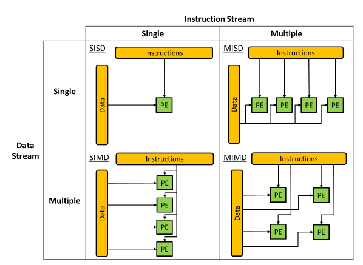
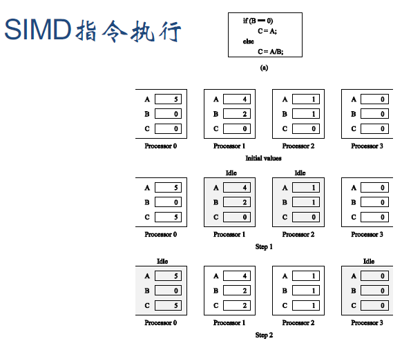

# 弗林分类法 Flynn
{: id="20210310110617-9n1sc7e" updated="20210310115114"}

{: id="20210310110617-qta8sik" updated="20210310110728"}

## SIMD
{: id="20210310110617-z7jjz61" updated="20210310103243"}

**SI**：每次只执行一条指令，没有办法同时执行两条指令。
{: id="20210310110617-lik6iwl" updated="20210310103336"}

**e.g:** 注意Idle状态
{: id="20210310110617-uae7kx7" updated="20210310103420"}

{: style="width: 389.94px;"}
{: id="20210310110617-g2i3o5a" updated="20210310110730"}

{: id="20210310110618-y3dnyhz"}

{: id="20210310110602-ir78or0" type="doc"}
