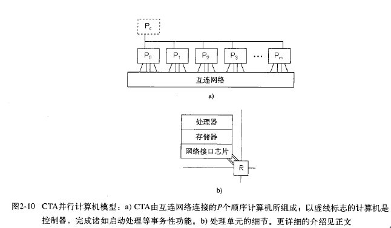
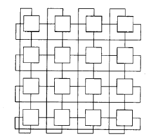
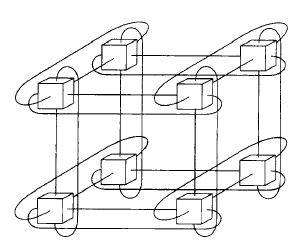
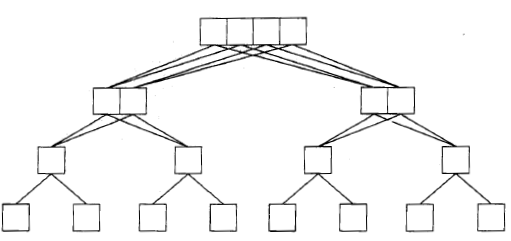
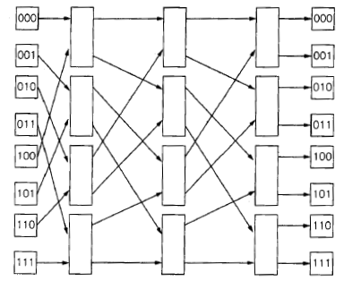

# CTA模型
{: id="20210310111856-pywklmh" updated="20210310111914"}

该模型被称为候选型体系结构(Candidate Type Architecture), 简称CTA 。CTA模型能显式地区分两类存储器访问，分别被称为低廉的本地访问和昂贵的非本地访问。
{: id="20210310111914-r63tak6" updated="20210310111917"}

由P个标准的顺序计算机（称为处理器或处理单元）所组成，这些处理器由一个互连网络（又称通信网络）相连接。
{: id="20210310111931-j8gbu4g" updated="20210310111939"}

{: id="20210310112730-46zdeyq" updated="20210310112741"}

## 存储器
{: id="20210310112025-9zeqtrg" updated="20210310112902"}

来往于网络上的数据存放在存储器中，通常借助直接存储器访问(DMA) 机制进行读写。
{: id="20210310112854-at80pnc" updated="20210310112854"}

处理器可以对自己的本地存储器（受cache支持）进行数据访问，其过程与标准顺序计算机的相类似。此外，处理器可以访问非本地存储器，即其他处理器单元的存储器。
{: id="20210310112850-93m6dr0" updated="20210310112853"}

### ((20210310113451-gt5bdgy "{{.text}}"))
{: id="20210310112918-rnthpzc" updated="20210310114632"}

## 网络接口芯片、网卡、NIC
{: id="20210310112810-hs1cg2k" updated="20210310112810"}

网络接口芯片(Network Interface Chip, NIC) 是处理器\/网络连接的媒介。
{: id="20210310112036-d50mchb" updated="20210310112728"}

## 互联网络中常见的拓扑模型
{: id="20210310112325-ah3emd1" updated="20210310112757"}

适合于并行计算机的最佳拓扑是需由体系结构师根据各种技术考虑作出的设计决策。程序员对拓扑并不感兴趣，因此在CTA模型中未显示其细节。
{: id="20210310112656-fzswhvi" updated="20210310113016"}

**二维环绕网**
{: id="20210310112331-h9gnum0" updated="20210310112527"}

{: id="20210310112340-sfey5hw" updated="20210310112347"}

**二元3立方体**
{: id="20210310112529-teh1qhd" updated="20210310112534"}

{: id="20210310112348-3li65tr" updated="20210310112353"}

**胖树**
{: id="20210310112536-iju498f" updated="20210310112545"}

{: id="20210310112353-aiwy4jn" updated="20210310112359"}

**$\Omega$网**
{: id="20210310112549-m7jw6bl" updated="20210310112647"}

{: id="20210310112400-lo3pnt6" updated="20210310112408"}

{: id="20210310112147-lf2fz4d" updated="20210310112805"}

## 总结
{: id="20210310112634-q3gaet7" updated="20210310113127"}

- {: id="20210310113128-9xu80lg"}有P个处理器，它们是执行本地指令的标准顺序计算机。
  {: id="20210310113128-3r1hu77" updated="20210310113140"}
- {: id="20210310113134-993p98a"}本地存储器访问时间即是通常顺序处理器的存储器访问时间。
  {: id="20210310113134-72nec2g" updated="20210310113140"}
- {: id="20210310113141-v6745j7"}非本地存储器的访问时间$\lambda>>1$($\lambda$为通信延迟), 可能比本地存储器的访问时间高出2-5 个数量级。
  {: id="20210310113141-i1ckmlw" updated="20210310113409"}
- {: id="20210310113306-lyfhvq2"}低结点度意味着一个处理器不能同时进行多个网络的传输（通常为1个或2个）。
  {: id="20210310113306-zk0lwx2" updated="20210310113311"}
- {: id="20210310113314-9lcxfqv"}一个全局的控制器以帮助完成如初始化、同步等基本操作。
  {: id="20210310113314-b8y9oou" updated="20210310113319"}
{: id="20210310113127-pm1tlnl" updated="20210310113318"}

### 本地性规则
{: id="20210310113320-7f6faz7" updated="20210310113331"}

> 速程序趋向千最大化本地存储器的访问次数和最小化非本地存储器的访问次数。
> {: id="20210310113341-q370oba" updated="20210310113345"}
{: id="20210310113331-8l2hasm" updated="20210310113342"}

{: id="20210310113345-9fiq1mj"}

{: id="20210310111856-r531cvn" type="doc"}
