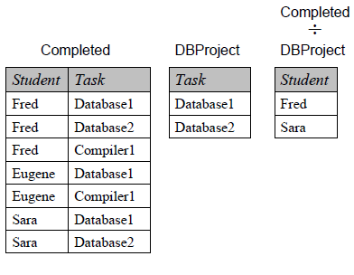

# 除法 division
{: id="20210311141306-79lgfo4" updated="20210311143808"}

$$
R \div S
$$
{: id="20210311142610-xr3bxbb" updated="20210311142640"}

1. {: id="20210311142716-13q8qq7"}取R与S的共同属性集a，取共同元组集a'。
   {: id="20210311142716-q7hq6oz" updated="20210311143152"}
2. {: id="20210311142717-hxp16hz"}取R中的属性集与a集的差b集。
   {: id="20210311142719-cknr4yu" updated="20210311142806"}
3. {: id="20210311142751-fynh290"}遍历b集的每一个元组：
   {: id="20210311142753-5xrbr80" updated="20210311142908"}
4. {: id="20210311142909-l5f9dxe"}当b集中的某个元组在R表中与a'关系为满射时，将该元组加入结果集。
   {: id="20210311142909-hg0lx9w" updated="20210311143155"}
{: id="20210311142641-otqtaf5" updated="20210311142716"}

**e.g:**
{: id="20210311142941-nfsrcxc" updated="20210311142951"}

{: id="20210311142953-e39vxib" updated="20210311143011"}

a: {task}、a': {Database1, Database2}
{: id="20210311143012-3vyvpiv" updated="20210311143213"}

b: {student}
{: id="20210311143029-g60urgh" updated="20210311143034"}

满射关系：
{: id="20210311143050-w8j954v" updated="20210311143117"}

- {: id="20210311143123-q3jgjeq"}{Fred} -> {{Database1}, {Database2}}
  {: id="20210311143123-t0w6745" updated="20210311143132"}
- {: id="20210311143132-5mkwlsy"}{Sara} -> {{Database1}, {Database2}}
  {: id="20210311143132-i0yoag3" updated="20210311143224"}
{: id="20210311143122-w23jfbl" updated="20210311143221"}

!((20210311143446-f5g9hqj "{{.text}}"))
{: id="20210311143908-pnsqye3" updated="20210311144004"}

{: id="20210311143655-mjvk1q3" type="doc"}
