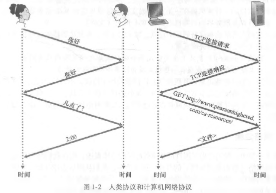

# 协议-定义
{: id="20210308103243-yqv2w0h" updated="20210310095640"}

((20210308075427-97ghrce "{{.text}}"))
{: id="20210310095703-pshxbft" updated="20210310095706"}

{: id="20210308103249-xkgtvzc" updated="20210308103302"}

协议（protocol）定义了**在两个或多个通信实体之间交换的报文的格式和顺序，以及报文发送和/或接收一条报文或其他事件所采取的动作**。
{: id="20210308103303-kx1ixjy" updated="20210308103344"}

{: id="20210308103345-w2gd1f3"}

{: id="20210308103243-er6q4q1" type="doc"}
