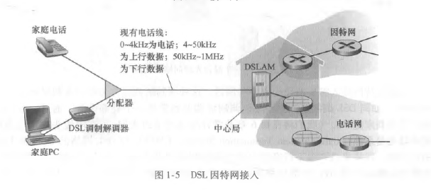

# 接入网
{: id="20210308103806-qfanfsp" updated="20210308103810"}

## 边缘路由器
{: id="20210308103810-st86dlv" updated="20210308103854"}

**边缘路由器**是端系统到任何其他远程端系统的路径上的第一台路由器。
{: id="20210308103854-v6i4abx" updated="20210308103909"}

## 家庭接入：DSL、电缆、FTTH、拨号和卫星
{: id="20210308103840-rsbdsgy" updated="20210308103928"}

### 数字用户线（DSL）
{: id="20210308103928-2sqzsyj" updated="20210308104108"}

{: id="20210308104109-m3gtyvo" updated="20210308104322"}

{: id="20210308104101-ei315wv"}

当使用DSL时，用户的本地电话公司也是它的ISP。
{: id="20210308103911-7p5pjya" updated="20210308104353"}

每个用户的DSL调制解调器使用现有的电话线（即双绞铜线）与位于电话公司的本地中心局（CO）中的**数字用户线接入复用器（DSLAM）**交换数据。
{: id="20210308104407-gfw8pjk" updated="20210308104503"}

### 电缆因特网接入
{: id="20210308104425-nzjej8e" updated="20210308104551"}

**电缆因特网接入（cable Internet access）**利用了有线电视公司现有的有线电视基础设施。
{: id="20210308104551-m97sv6x" updated="20210308104614"}

{: id="20210308104614-wks44op" updated="20210308104625"}

#### 电缆调制解调器
{: id="20210308104626-k1wu1lp" updated="20210308104901"}

电缆因特网接入需要特殊的调制解调器，这种调制解调器称为**电缆调制解调器（cable modem）**。
{: id="20210308104850-ufmf8li" updated="20210308104850"}

#### 电缆调制解调器端接系统
{: id="20210308104859-c0rrera" updated="20210308104953"}

在电缆头端，**电缆调制解调器端接系统（Cable Modem Termination System, CMTS）**与DSL网络的DSLAM具有类似的功能，即将来自许多下行家庭中的电缆调制解调器发送的模拟信号转换回数字形式。
{: id="20210308104953-44vuvig" updated="20210308105021"}

### 光纤到户(Fiber To The Home, FTTH)
{: id="20210308105030-75qivv5" updated="20210308105142"}

从本地中心局直接到家庭提供了一条光纤路径。
{: id="20210308105111-utl48zf" updated="20210308105135"}

分为主动光纤网络（Active Optical Network, AON)和被动光纤网络(Passive Optical Network, P0N)。
{: id="20210308105212-1y03o18" updated="20210308105220"}

{: id="20210308105222-p48rlvr" updated="20210308105248"}

[以上为pon示意图]
{: id="20210308105143-ow5b189" updated="20210308105305"}

## 企业(和家庭)接入：以太网和WIFI
{: id="20210308105307-nsbzfvw" updated="20210308105339"}

### 以太网接入
{: id="20210308105558-j74r0kg" updated="20210308105602"}

{: id="20210308105349-tkb19gv" updated="20210308105455"}

使用局域网（LAN）将端系统连接到边缘路由器。以太网用户使用双绞铜线与一台以太网交换机相连。
{: id="20210308105456-c5rlpf7" updated="20210308105541"}

### WIFI
{: id="20210308105545-qrv2cw3" updated="20210308105607"}

在无线LAN环境中，无线用户从（到）一个接入点发送（接收）分组，该接入点与企业网连接（很可能使用了有线以太网），企业网再与有线因特网相连。
{: id="20210308105607-e0vg2tl" updated="20210308105715"}

## 广域无线接入：3G和LTE
{: id="20210308105700-hwmmjoz" updated="20210308105744"}

{: id="20210308105744-tsnlps1" updated="20210308105927"}

应用了与蜂窝移动电话相同的无线基础设施，通过蜂窝网提供商运营的基站来发送和接收分组。与WiFi不同的是，一个用户仅需要位于基站的数万米(而不是几十米)范围内。
{: id="20210308105929-j7uesdh" updated="20210308110024"}

{: id="20210308110026-kw0ky6y"}

{: id="20210308103805-q9pgftq" type="doc"}
