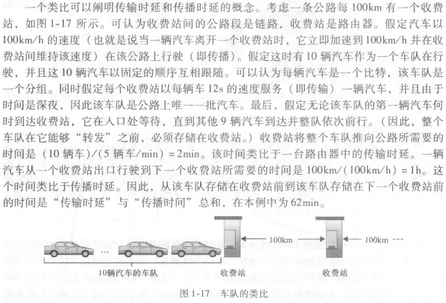
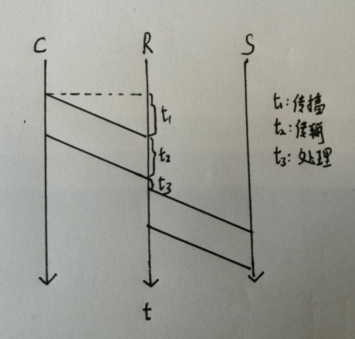

# 时延（分组交换网中）
{: id="20210310082100-2qqwpww" updated="20210310091316"}

## 时延-分类
{: id="20210310083529-uey89cg" updated="20210310083542"}

((20210308110441-ehqr6k1 "{{.text}}"))
{: id="20210310082412-xn1nh2j" updated="20210310082417"}

- {: id="20210310082136-khh2j2u"}((20210310082158-6v629ao "{{.text}}"))
  {: id="20210310082136-cs24p49" updated="20210310082221"}
- {: id="20210310082146-5pivgol"}((20210308112241-96wu69q "{{.text}}"))
  {: id="20210310082146-h158iu9" updated="20210310082232"}
- {: id="20210310082150-9c20nnv"}((20210310082207-40vds98 "{{.text}}"))
  {: id="20210310082150-so5y06h" updated="20210310082241"}
- {: id="20210310082152-r6e65qg"}((20210310082209-8e1ztvb "{{.text}}"))
  {: id="20210310082152-scp24sb" updated="20210310082245"}
{: id="20210310082127-gwhjqr5" updated="20210310082136"}

### 节点处理时延
{: id="20210310082158-6v629ao" updated="20210310083846"}

包括 **检查分组首部** 和 **决定将该分组导向何处** 所需要的时间，也包括其他因素，比如检查比特级别的差错所需要的时间。
{: id="20210310082252-bdkulw5" updated="20210310082537"}

### 排队时延
{: id="20210310082203-7uz4hee" updated="20210310083843"}

取决于 **先期到达的正在排队等待向链路传输的分组数量** 。
{: id="20210310082253-cfwgwgm" updated="20210310082745"}

实际的排队时延可以是毫秒到微秒量级。
{: id="20210310082858-f30cx5j" updated="20210310082858"}

### 传输时延
{: id="20210310082207-40vds98" updated="20210310083844"}

将所有分组的比特推向链路(即传输，或者说发射)所需要的时间。
{: id="20210310082255-cvadmce" updated="20210310082822"}

传输时延是L\/R。
{: id="20210310082823-7n4uvng" updated="20210310082938"}

L为数据大小，R为((20210308075004-nai5pwj "{{.text}}"))。
{: id="20210310082940-br2zzt0" updated="20210310083421"}

实际的传输时延通常在毫秒到微秒量级。
{: id="20210310082902-9p0y6m4" updated="20210310083009"}

### 传播时延
{: id="20210310082209-8e1ztvb" updated="20210310083847"}

一旦一个比特被推向链路，该比特需要向路由器B传播。从该链路的起点到路由器B传播所需要的时间是传播时延。
{: id="20210310082255-qqu1e5t" updated="20210310083031"}

传播时延是d\/s。
{: id="20210310083036-wz6g1z8" updated="20210310083045"}

d为路由器之间的距离，s取决于于该链路的物理媒体（即光纤、双绞铜线等），其速率范围是2\*10^8^~3\*10^8^m/s。
{: id="20210310083145-8wmvtkx" updated="20210310083358"}

在广域网中，传播时延为毫秒量级。
{: id="20210310083317-9zuu8rw" updated="20210310083341"}

## 传输时延、传播时延的区别
{: id="20210310083554-yltnjzg" updated="20210310083631"}

{: id="20210310083045-4ijkmz2" updated="20210310083630"}

## 总时延
{: id="20210310082248-0jjbgwc" updated="20210310083840"}

$$
d_{nodal} = d_{proc} + d_{queue} + d_{trans} + d_{prop}
$$
{: id="20210310083851-2lwk5el" updated="20210310083931"}

$$
d_{proc}：处理时延、d_{queue}：排队时延、d_{trans}：传输时延、d_{prop}：传播时延
$$
{: id="20210310083840-wi569zf" updated="20210310084100"}

{: id="20210310090530-s2i8s3b" updated="20210310090614"}

## 丢包
{: id="20210310090608-7aa4x5v" updated="20210310090645"}

**原因**：排队容量是有限的，随着流量强度接近1,排队时延并不真正趋向无穷大。
{: id="20210310090646-i03jwbg" updated="20210310090703"}

当队列存满时，没有地方存储到达的分组，路由器将 **丢弃(drop)** 该分组，即该分组将 **丢失(lost)** 。
{: id="20210310090709-flmkrqf" updated="20210310090803"}

{: id="20210310090703-cypo5fe"}

{: id="20210310082100-t8fx7jt" type="doc"}
