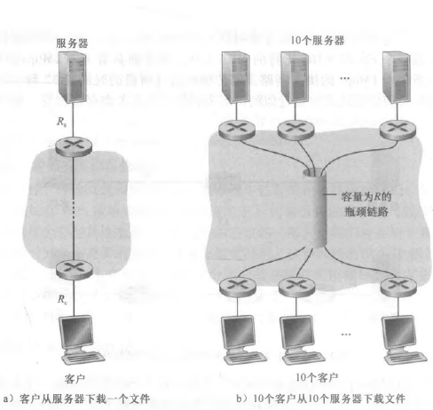

# 吞吐量
{: id="20210310091225-7p7q9jb" updated="20210310091229"}

((20210308075004-nai5pwj "{{.text}}"))
{: id="20210310091229-itw06gd" updated="20210310092550"}

## 瞬间吞吐量
{: id="20210310092545-rxodz4y" updated="20210310092545"}

接收端瞬间接收文件的速率。
{: id="20210310092333-5nbnauv" updated="20210310092525"}

## 平均吞吐量
{: id="20210310092525-rwry850" updated="20210310092529"}

设F为文件大小，单位比特，则平均吞吐量为$F/Tbps$。
{: id="20210310092529-4hvudyl" updated="20210310092818"}

## 瓶颈链路
{: id="20210310092818-ud79dkr" updated="20210310092846"}

设N条链路的传输速率分别是$R_1, R_2, …, R_N$，则从服务器到客户的文件传输吞吐量为$min\{R_1, R_2, ..., R_N\}$。
{: id="20210310092846-dkr8ezs" updated="20210310093151"}

此时，称传输速率最小的链路为 **瓶颈链路(bottleneck link)** ；称$min\{R_1, R_2, ..., R_N\}$为该瓶颈链路的传输速率。
{: id="20210310093130-xgrv02d" updated="20210310093312"}

{: id="20210310093242-gpjlwak" updated="20210310093328"}

{: id="20210310093331-hr80oqu"}

{: id="20210310091225-y2fseeb" type="doc"}
