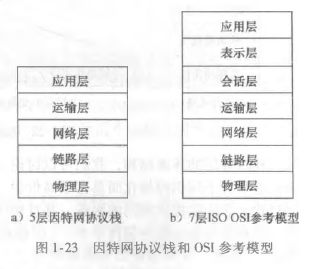

# 分层的体系结构
{: id="20210310093521-gxuexyz" updated="20210310094058"}

## 协议分层
{: id="20210310094058-xi0fmyf" updated="20210310094102"}

((20210308075427-97ghrce "{{.text}}"))
{: id="20210310095552-6hefvkd" updated="20210310095556"}

((20210308103243-er6q4q1 "{{.text}}"))
{: id="20210310095610-7h5lezp" updated="20210310095648"}

### 分层
{: id="20210310095730-gwpmo5m" updated="20210310095732"}

网络设计者以分层（layer）的方式组织协议以及实现这些协议的网络硬件和软件。
{: id="20210310094103-zg4y0c1" updated="20210310095545"}

### 服务
{: id="20210310095734-ybe48nb" updated="20210310095737"}

某层向它的 **上一层** 提供服务（service）,即所谓一层的服务模型（service model）。每层通过 **在该层中执行某些动作或使用直接下层的服务来提供服务** 。
{: id="20210310095737-j0yvkzj" updated="20210310095832"}

### 协议栈
{: id="20210310095905-79sphn6" updated="20210310095914"}

各层的所有协议被称为协议栈（protocol stack）。因特网的协议栈由5个层次组成：
{: id="20210310095914-jv7gddz" updated="20210310095936"}

{: id="20210310095936-mm2kyf6" updated="20210310095945"}

**OSI**：官方推出的标准，并没有被采用。
{: id="20210310095847-o7engi3" updated="20210310100042"}

#### 应用层
{: id="20210310100042-kfbq0bj" updated="20210310100427"}

逻辑链路
{: id="20210310100441-9ar4fyd" updated="20210310100500"}

os的user space层
{: id="20210310100808-in12eoq" updated="20210310100814"}

#### 传输层
{: id="20210310100423-zgrdkdg" updated="20210310100444"}

提供端到端（end to end）服务，封装路由器。
{: id="20210310100429-dyjlfds" updated="20210310100511"}

os的kernel层
{: id="20210310100758-mtyfznb" updated="20210310101105"}

#### 网络层
{: id="20210310100528-9lhg0qr" updated="20210310100531"}

转发、寻址，点到点（point to point）服务
{: id="20210310100531-arxmpz4" updated="20210310100708"}

os的kernel层
{: id="20210310100931-dech118" updated="20210310100931"}

主要在路由器上
{: id="20210310100920-x4t51g7" updated="20210310100932"}

#### 链路层
{: id="20210310100540-jvwg1b4" updated="20210310100547"}

具体分组的走法
{: id="20210310100547-5oj0mfu" updated="20210310100602"}

NIC(Peripheral Device)，网卡（外设）
{: id="20210310100821-u8lmf8x" updated="20210310101133"}

{: id="20210310101033-vcna2ai"}

{: id="20210310100603-ylw7gg6"}

{: id="20210310095756-bijqem9"}

{: id="20210310095718-mv2yrwj"}

{: id="20210310095546-ewl1qth"}

{: id="20210310093521-sy4lmrx" type="doc"}
